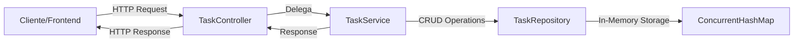
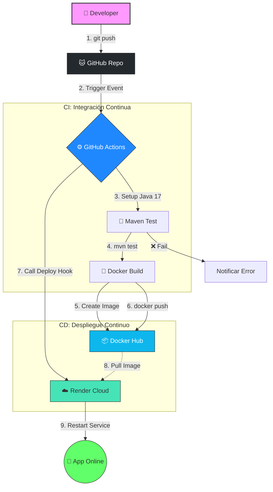

# InsightFlow Task Service

Microservicio de gestión de tareas para la plataforma InsightFlow.

## Descripción

Permite crear, consultar, actualizar y eliminar tareas dentro de documentos, con soporte para tableros Kanban y gestión colaborativa.

## Arquitectura

Este proyecto utiliza una Arquitectura en capas con el patrón repository

| Layer | Función   |
|------|----------|
| Controller Layer (REST API) | Exposición de endpoints   |
| Service Layer (Business)  | Lógica de negocio |
| Repository Layer (Data Access)  | Acceso a datos |
| Model Layer (Entities/DTOs)  |  Modelos de dominio | 

## Flujo de los datos


## Estructura del proyecto

```
insightflow-tasks-service/
├── src/
│   ├── main/
│   │   ├── java/com/insightflow/tasks/
│   │   │   ├── TasksServiceApplication.java    # Clase principal
│   │   │   ├── config/
│   │   │   │   ├── DataSeeder.java             # Datos de ejemplo
│   │   │   │   └── CorsConfig.java             # Configuración de CORS
│   │   │   ├── controller/
│   │   │   │   └── TaskController.java         # Endpoints REST
│   │   │   ├── dto/
│   │   │   │   └── TaskDTOs.java               # DTOs
│   │   │   ├── exception/
│   │   │   │   ├── TaskNotFoundException.java  # Excepciones
│   │   │   │   └── GlobalExceptionHandler.java # Manejo de errores
│   │   │   ├── model/
│   │   │   │   └── Task.java                   # Entidad principal
│   │   │   ├── repository/
│   │   │   │   └── TaskRepository.java         # Acceso a datos
│   │   │   └── service/
│   │   │       └── TaskService.java            # Lógica de negocio
│   │   └── resources/
│   │       └── application.properties          # Configuración
├── .github/
│   └── workflows/
│       └── deploy.yml                          # Pipeline CI/CD
├── Dockerfile                                  # Configuración Docker
├── pom.xml                                     # Dependencias Maven
└── README.md                                   # Este archivo
```

## Tecnologías usadas

### Tecnologías principales

#### Core Framework
- **Spring Boot 3.3.6**: Framework principal para desarrollo de aplicaciones Java
- **Java versión 17**: Lenguaje de programación
- **Maven 4.0**: Gestión de dependencias y construcción del proyecto

#### Dependencias principales
- **Lombok**: Reducción de código boilerplate.
- **Spring Web**: Desarrollo de APIs REST
- **Spring Validation**: Validación de datos con Bean Validation
- **Jackson**: Serialización/deserialización JSON
- **SpringDoc OpenAPI**: Documentación automática de la API

### DevOps y despliegue
- **Docker / Docker Compose**: Contenerización.
- **GitHub**: Control de versiones.
- **GitHub Actions**: CI/CD Pipeline
- **Render**: Plataforma de despliegue
  
## Requisitos

- [Java 17+](https://adoptium.net/) - JDK de Java versión 17 o superior
- [Maven 4.0+](https://maven.apache.org/) - Herramienta de construcción (Opcional se incluye Maven en el proyecto)
- [Docker y Docker compose](https://www.docker.com/products/docker-desktop/) -Para contenerización 
- [Git](https://git-scm.com/) - Control de versiones
- [Postman](https://www.postman.com/) - Para probar endpoints (Opcional)

```bash
# Verificar Java
java -version
# Output esperado: openjdk version "17.x.x"

# Verificar Maven
mvn -version
# Output esperado: Apache Maven 4.0.x
```

## Instalación y configuración

## 1.Clonar repositorio
```bash
$ git clone https://github.com/InsightFlowTaller3ArquietcturaDeSistema/InsightFlow-task-service.git
cd insightflow-tasks-service
```

## 2.Instalar Dependencias

```bash
#Se se instalo Maven
mvn clean install
#Si no se instalo Maven
./mvnw clean install
```

## 2.1. Creación de imagen Docker (Opcional)

```bash
docker build -t task-service .     
```

### 2.2. Ejecución Local con Maven

```bash
#Se se instalo Maven
mvn spring-boot:run
#Si no se instalo Maven
./mvnw spring-boot:run    
```

### 2.3 Ejecución Local con Docker

```bash
docker run -p 8080:8080 task-service    
```

### Endpoints de la API

```bash
Local: http://localhost:8080/api/tasks
Producción: https://task-service-5dmf.onrender.com
```

## Data Seeder

El proyecto incluye un seeder automático que carga 7 tareas de ejemplo al iniciar la aplicación.

Este seeder **se ejecuta automáticamente**.

## CI/CD Pipeline



#### Secrets necesarios

- **DOCKER_USERNAME**: Usuario Docker Hub
- **DOCKER_PASSWORD**: Token de acceso de Docker Hub

#### Webhooks necesarios

- **RENDER_DEPLOY_HOOK_URL**: Webhook de Render


## API Endpoints (REST)

Este servicio expone endpoints RESTful a través del protocolo HTTP en el puerto configurado (por defecto 8080). Las peticiones y respuestas utilizan formato JSON.

| Método   | Endpoint | Descripción   |
|----------|------|----------|
| GET      | /api/tasks/tasks  | Obtiene el listado de todas las tareas del sistema. |
| GET   | /api/tasks/{id}   | Obtiene los detalles de una tarea específica por su ID. |
| GET   | /api/tasks/document/{documentId}/tasks | Obtiene todas las tareas vinculadas a un documento específico. |
| GET   | /api/tasks/users/{userId}/tasks   | Obtiene todas las tareas asignadas a un usuario específico. |
| POST    | /api/tasks  | Crea una nueva tarea asociada a un documento. |
| PATCH     | /api/tasks/{id} | Actualiza los detalles generales de una tarea (título, descripción, prioridad, etc.). | 
| PUT  | /api/tasks/{id}/status | Actualiza exclusivamente el estado de una tarea (PENDING, IN_PROGRESS, COMPLETED) |
| DELETE | /api/tasks/{id} | Elimina lógicamente una tarea del sistema (Soft Delete). | 

**Documentación Interactiva**: Todos los enpoints se pueden probar directamente accediendo a Swagger UI en /swagger-ui.html cuando el servicio está en ejecución.

### Documentación

- [Spring Boot Documentation](https://spring.io/projects/spring-boot)
- [Java 17 Documentation](https://docs.oracle.com/en/java/javase/17/)
- [Docker Documentation](https://docs.docker.com/)
- [Render Documentation](https://render.com/docs)
- [Maven Documentation](https://maven.apache.org/guides/)
